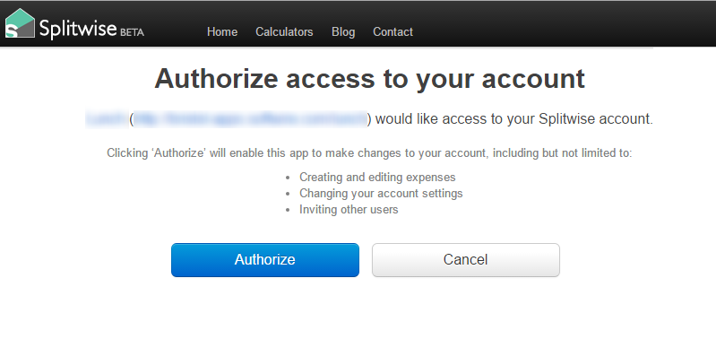

splitwise-node
===========

[](https://circleci.com/gh/Dean177/splitwise-node)

A javascript wrapper for the Splitwise API.

Install with npm 

```sh
npm install splitwise-node
```

## Usage

- Get your ConsumerToken and ConsumerSecret from [Splitwise](https://secure.splitwise.com/apps)
- Get an authorization url to send your user to:
```javascript
var AuthApi = require('splitwise-node');

var userOAuthToken, userOAuthTokenSecret;
var authApi = new AuthApi(ConsumerKey, ConsumerSecret);
var userAuthUrl = authApi.getOAuthRequestToken()
    .then(({ token, secret }) => {
        [userOAuthToken, userOAuthTokenSecret] = [token, secret];
        return api.getUserAuthorisationUrl(token);
    });
```
- Get your user to authorize your token by visiting the authorization url

- Now you can api away
```javascript
var splitwiseApi = authApi.getSplitwiseApi(userOAuthToken, userOAuthTokenSecret);

```

## License

[MIT](LICENSE)
